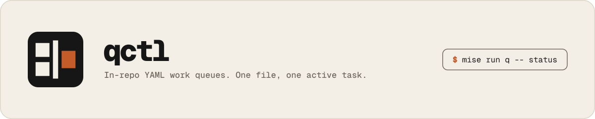

# qctl

<picture>
  <source media="(prefers-color-scheme: dark)" srcset="docs/banner-dark.svg">
  
</picture>

Control in-repo YAML work queues. One file, one active task, file order is
priority. Replaces copied Ajv `test:ledger` scripts.

```sh
mise run q -- check
mise run q -- status
mise run q -- add -t 'Title' -s repo -o 'Done when…' -a 'Acceptance'
mise run q -- start OMX-001
mise run q -- archive OMX-001 -e 'Shipped.'
```

Consumer mise catalog — copy [`examples/mise.toml`](examples/mise.toml), which
pins the tool and the task include to the same release:

```toml
[task_config]
includes = [
  "git::https://github.com/victor-software-house/qctl.git//tasks/q?ref=v0.2.0",
  "mise-tasks",
]
```

Install:

```sh
cargo install qctl --locked
# or the native tarball:
mise x github:victor-software-house/qctl@0.2.0 -- qctl --version
```

Do not name this `taskctl` (existing Go Make alternative) or `pi-tasks`
(different VSH TypeScript product).
